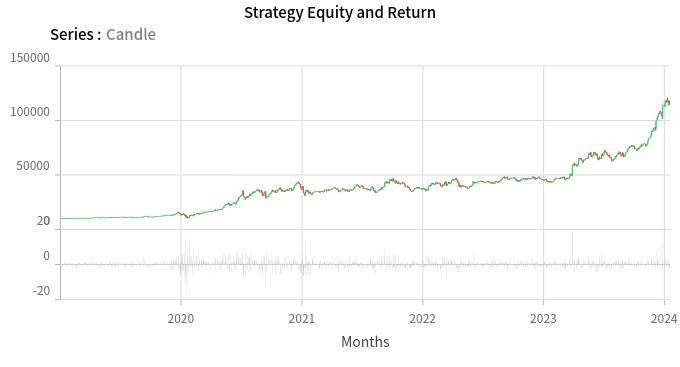

<!-- ## Welcome -->

## About Me

- I'm Jerry Yang, a CS student at HITSZ. I will start pursuing MS CSE (CS76) at UCSD in Fall 2024.
- Currently focusing on synthesis, have some knowledge about operating system and machine learning.
- Always interested in building a stock trading bot using automated trading strategies. <!-- You can find me @... in https://www.quantconnect.com/ -->

## GitHub Stats

|  | |
| ----------------- | ----------------- |

<!--  -->
<!--
https://github.com/abhisheknaiidu/awesome-github-profile-readme
https://github.com/anuraghazra/github-readme-stats -->

## Quant Connect

### Backtest

<!--  -->

<!-- ](./assets/StockChart.png) -->

### Live Trading

TODO
